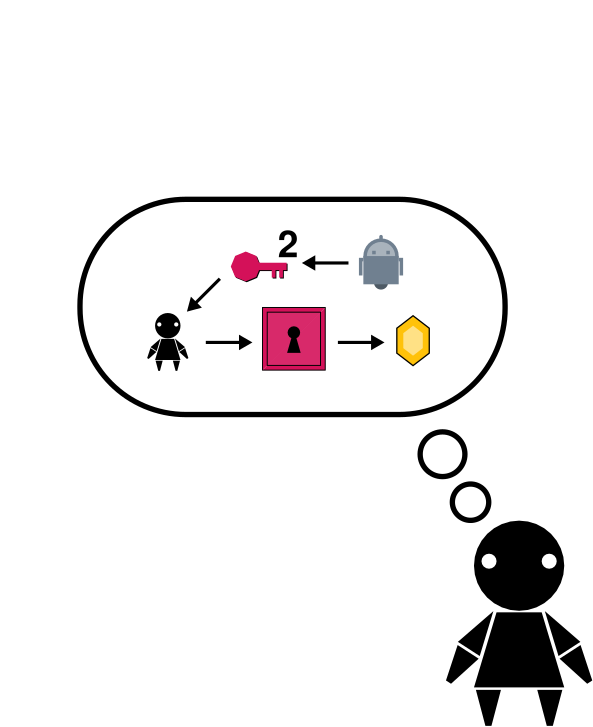
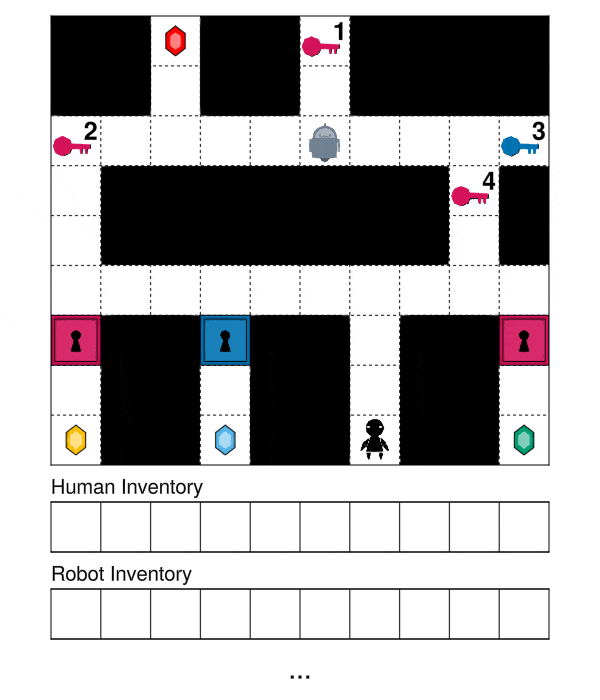
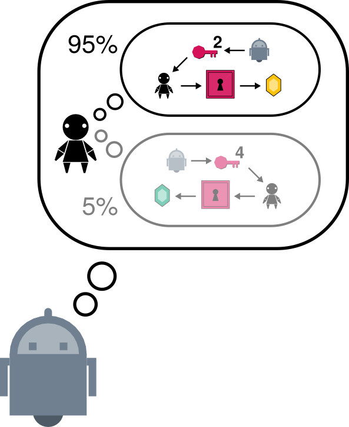

# Cooperative Language-Guided Inverse Plan Search (CLIPS)

CLIPS is an architecture for pragmatic instruction following and goal assistance via cooperative Bayesian inverse planning with language model likelihoods.

Using CLIPS, you can build assistive agents that infer the goals of humans from both their actions and instructions. This allows CLIPS to interpret ambiguous instructions, because an agent's actions or goals may help to disambiguate such instructions.

<p align="center">



</p>

This repository contains a Julia implementation of CLIPS built using the [Gen.jl](https://github.com/probcomp/Gen.jl) probabilistic programming system, the [PDDL.jl](https://github.com/JuliaPlanners/PDDL.jl) planning library, and the [InversePlanning.jl](https://github.com/probcomp/InversePlanning.jl) library for Bayesian inverse planning.

CLIPS was originally developed under the [MIT Probabilistic Computing Project](http://probcomp.csail.mit.edu/) and the [MIT Computational Cognitive Science lab](https://cocosci.mit.edu/). For more details about CLIPS, see [our paper](https://arxiv.org/abs/2402.17930):

> Tan Zhi-Xuan, Lance Ying, Vikash Mansinghka, and Joshua B. Tenenbaum. 2024. **Pragmatic Instruction Following and Goal Assistance via Cooperative Language-Guided Inverse Planning.** In Proc. of the 23rd International Conference on Autonomous Agents and Multiagent Systems (AAMAS 2024).

## Setup

This repository requires Julia 1.6 and above, which can be downloaded at https://julialang.org/. Using VSCode for the [Julia for VSCode](https://www.julia-vscode.org/) extension is recommended, so that you can run scripts interactively (similar to Jupyter notebooks).

To set up the environment for this project, first open the Julia REPL in this directory, then run the following commands in via the REPL's `Pkg` mode:

```julia-repl
activate .
add GenGPT3.jl https://github.com/cosilab/InversePlanning.jl.git#release-0.0.1
instantiate
```

To use GenGPT3.jl, add your OpenAI API key as an environment variable named `OPENAI_API_KEY`. You can follow [this guide](https://help.openai.com/en/articles/5112595-best-practices-for-api-key-safety), or set `ENV["OPENAI_API_KEY"]` to the value of your API key in the Julia REPL. To keep your API key secure, **do not** save its value within this repository.

## Tutorial

The `tutorial` folder contains a notebook that provides a conceptual introduction to CLIPS. This notebook can be run in Julia for VSCode (`tutorial/tutorial.jl`), or in Jupyter (`tutorial/tutorial.ipynb`).

You can also run  the notebook using Google Colab via [this URL](https://colab.research.google.com/github/probcomp/CLIPS.jl/blob/master/tutorial/tutorial_colab.ipynb), provided that you install Julia on Colab by following the instructions in [this template](https://colab.research.google.com/github/ageron/julia_notebooks/blob/master/Julia_Colab_Notebook_Template.ipynb).

## Repository Structure

This repository contains code for the multi-agent Doors, Keys & Gems domain in the `doors-keys-gems` folder, and code for our VirtualHome experiments in `virtual-home`. For each domain, there is a:

- `dataset` folder, containing the PDDL domain, problems, observed actions and utterances, and for `doors-keys-gems`, a set of visual stimuli for our human experiments.
- `src` folder, containing reusable code (utterance models, planner configurations, inference algorithms and baselines)
- `experiments.jl`, a script that runs CLIPS and the other baselines on the full dataset of goal assistance problems.
- `testbed.jl`, a script that allows for experimenting with and reconfiguring CLIPS for a single goal assistance problem.

The `doors-keys-gems` folder also contains a `stimuli.jl` script for generating the stimuli GIFs used in our human experiments.